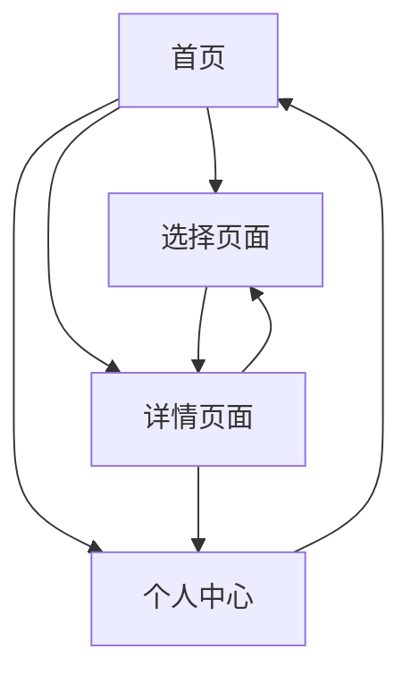

# funnyEat 微信小程序产品需求文档

## 1. Product Overview
funnyEat 是一个精简实用的微信小程序，专注解决用户"每天吃什么"的选择困难问题。
- 通过现代化扁平设计和智能推荐，为用户提供快速、便捷的用餐决策体验。
- 目标用户为有选择困难症的上班族、学生群体，帮助他们快速决定每日用餐。
- 产品价值：简化用餐选择流程，提升用户生活效率，打造轻量级生活助手。

## 2. Core Features

### 2.1 User Roles
由于产品主打精简实用，暂不区分用户角色，所有用户享有相同功能权限。

### 2.2 Feature Module
我们的小程序需求包含以下核心页面：
1. **首页**：今日推荐、快速选择、分类浏览
2. **选择页面**：随机推荐、筛选条件、结果展示
3. **详情页面**：菜品详情、营养信息、制作建议
4. **个人中心**：历史记录、偏好设置、收藏管理

### 2.3 Page Details

| Page Name | Module Name | Feature description |
|-----------|-------------|---------------------|
| 首页 | 今日推荐 | 基于时间和用户偏好展示每日推荐菜品，包含菜品图片、名称、简介 |
| 首页 | 快速选择 | 提供"摇一摇"或"点击选择"按钮，快速随机推荐一道菜品 |
| 首页 | 分类浏览 | 按菜系（川菜、粤菜等）、类型（荤菜、素菜、汤品）、难度分类展示 |
| 选择页面 | 随机推荐 | 点击按钮随机生成菜品推荐，支持重新随机选择 |
| 选择页面 | 筛选条件 | 根据口味偏好、制作时间、食材类型等条件筛选菜品 |
| 选择页面 | 结果展示 | 展示推荐结果，包含菜品图片、名称、标签、简要介绍 |
| 详情页面 | 菜品详情 | 显示菜品高清图片、详细介绍、所需食材清单 |
| 详情页面 | 营养信息 | 展示卡路里、营养成分、适宜人群等健康信息 |
| 详情页面 | 制作建议 | 提供简化版制作步骤、烹饪时间、难度等级 |
| 个人中心 | 历史记录 | 记录用户选择过的菜品历史，支持查看和重新选择 |
| 个人中心 | 偏好设置 | 设置口味偏好、忌口食材、制作难度等个人偏好 |
| 个人中心 | 收藏管理 | 收藏喜欢的菜品，支持分类管理和快速访问 |

## 3. Core Process

**主要用户操作流程：**
1. 用户打开小程序进入首页
2. 可选择查看今日推荐、使用快速选择功能或浏览分类
3. 在选择页面设置筛选条件或直接随机推荐
4. 查看推荐结果，点击感兴趣的菜品进入详情页
5. 在详情页查看完整信息，可选择收藏或返回重新选择
6. 在个人中心管理历史记录、偏好设置和收藏

## 4. User Interface Design

### 4.1 Design Style
- **主色调**：温暖橙色 (#FF6B35) 作为主色，浅灰色 (#F5F5F5) 作为背景色
- **按钮样式**：圆角矩形按钮，采用渐变效果和轻微阴影
- **字体**：微信默认字体，标题使用 18px，正文使用 14px，辅助信息使用 12px
- **布局风格**：卡片式布局，顶部导航栏，底部标签栏导航
- **图标风格**：线性图标配合填充图标，使用食物相关的可爱图标和emoji

### 4.2 Page Design Overview

| Page Name | Module Name | UI Elements |
|-----------|-------------|-------------|
| 首页 | 今日推荐 | 大尺寸卡片展示，包含高质量菜品图片、渐变遮罩、白色标题文字 |
| 首页 | 快速选择 | 居中的圆形按钮，橙色渐变背景，白色"摇一摇"图标，点击动画效果 |
| 首页 | 分类浏览 | 网格布局的分类卡片，每个卡片包含代表性图标和分类名称 |
| 选择页面 | 筛选条件 | 标签式选择器，选中状态为橙色背景，未选中为灰色边框 |
| 选择页面 | 结果展示 | 列表式卡片布局，左侧菜品缩略图，右侧信息文字，底部操作按钮 |
| 详情页面 | 菜品详情 | 全屏轮播图片，下方白色卡片承载详细信息，分段式内容布局 |
| 个人中心 | 功能列表 | 简洁的列表项设计，左侧图标，右侧箭头，分割线区分不同功能区域 |

### 4.3 Responsiveness
专为微信小程序设计，适配不同尺寸手机屏幕，支持触摸交互优化，包含手势操作和触觉反馈。