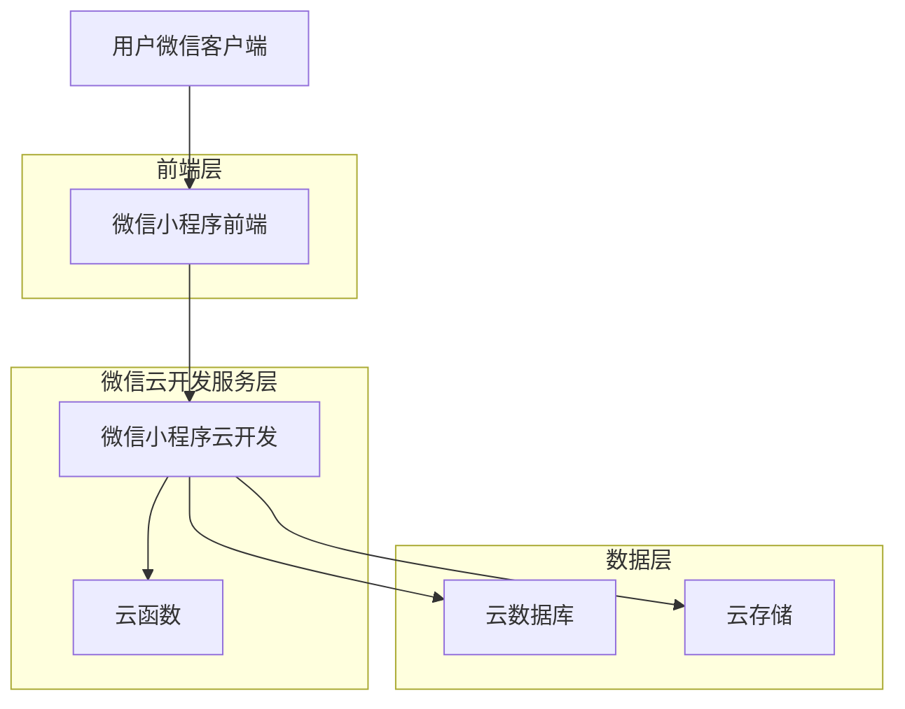
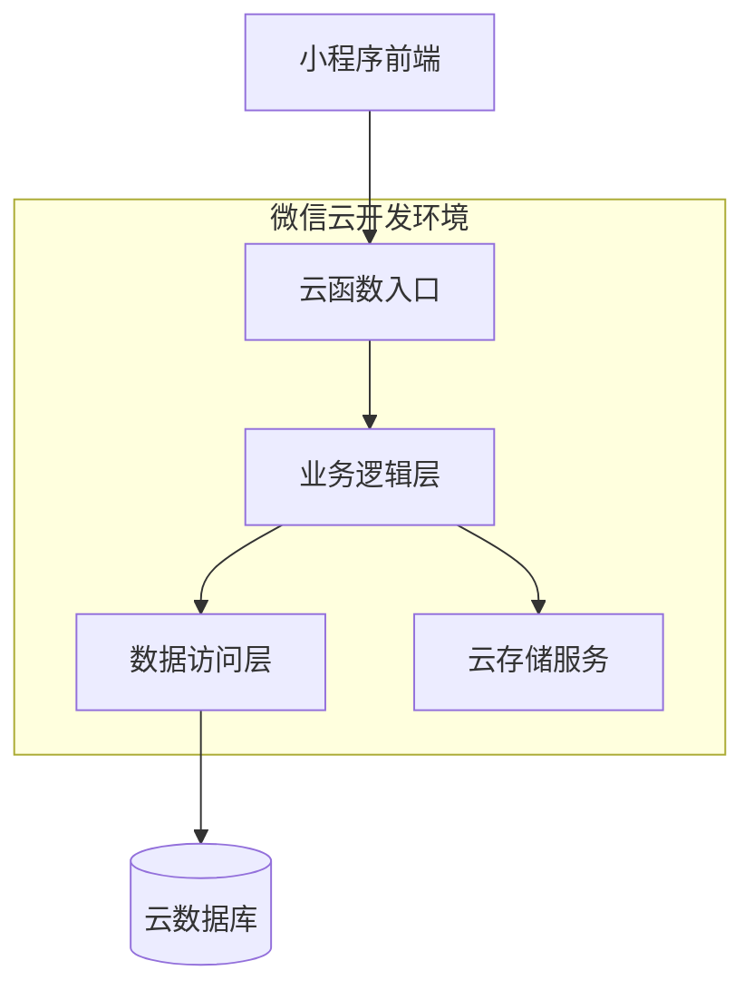
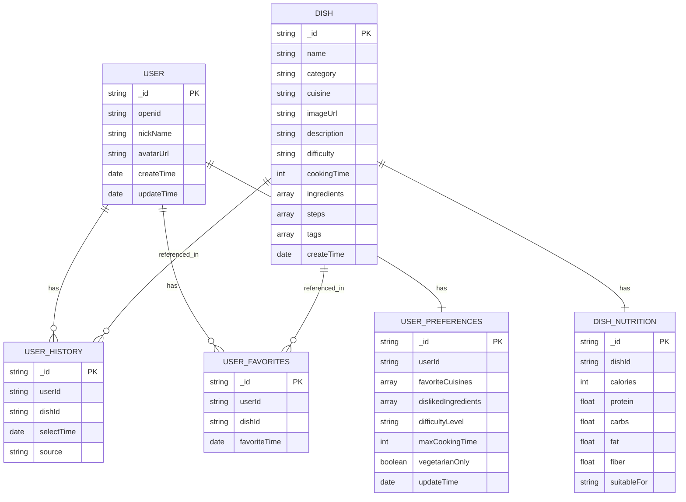

# funnyEat 微信小程序技术架构文档

## 1. Architecture design



## 2. Technology Description

* 前端：微信小程序原生开发 + WeUI组件库 + Vant Weapp UI库

* 后端：微信小程序云开发（云函数 + 云数据库 + 云存储）

* 数据库：微信云开发数据库（基于MongoDB）

* 存储：微信云存储（菜品图片、用户头像等静态资源）

## 3. Route definitions

| Route                      | Purpose                 |
| -------------------------- | ----------------------- |
| /pages/index/index         | 首页，展示今日推荐、快速选择和分类浏览功能   |
| /pages/choose/choose       | 选择页面，提供筛选条件和随机推荐功能      |
| /pages/detail/detail       | 详情页面，展示菜品详细信息、营养成分和制作建议 |
| /pages/profile/profile     | 个人中心，管理历史记录、偏好设置和收藏     |
| /pages/history/history     | 历史记录页面，查看用户选择历史         |
| /pages/favorites/favorites | 收藏页面，管理用户收藏的菜品          |
| /pages/settings/settings   | 设置页面，配置个人偏好和应用设置        |

## 4. API definitions

### 4.1 Core API

**菜品相关接口**

获取推荐菜品

```
Cloud Function: getRecommendedDishes
```

请求参数:

| 参数名         | 参数类型   | 是否必需  | 描述           |
| ----------- | ------ | ----- | ------------ |
| userId      | string | false | 用户ID，用于个性化推荐 |
| category    | string | false | 菜品分类筛选       |
| preferences | object | false | 用户偏好设置       |

响应数据:

| 参数名     | 参数类型    | 描述     |
| ------- | ------- | ------ |
| success | boolean | 请求是否成功 |
| data    | array   | 推荐菜品列表 |
| message | string  | 响应消息   |

示例:

```json
{
  "success": true,
  "data": [
    {
      "id": "dish001",
      "name": "宫保鸡丁",
      "category": "川菜",
      "image": "https://example.com/dish001.jpg",
      "difficulty": "中等",
      "cookingTime": "30分钟",
      "calories": "280kcal"
    }
  ],
  "message": "获取成功"
}
```

**用户相关接口**

保存用户偏好

```
Cloud Function: saveUserPreferences
```

请求参数:

| 参数名         | 参数类型   | 是否必需 | 描述     |
| ----------- | ------ | ---- | ------ |
| userId      | string | true | 用户唯一标识 |
| preferences | object | true | 偏好设置对象 |

响应数据:

| 参数名     | 参数类型    | 描述     |
| ------- | ------- | ------ |
| success | boolean | 保存是否成功 |
| message | string  | 响应消息   |

## 5. Server architecture diagram



## 6. Data model

### 6.1 Data model definition



### 6.2 Data Definition Language

**用户表 (users)**

```javascript
// 微信小程序云开发使用 NoSQL 数据库，以下为数据结构示例

// 用户集合
db.collection('users').add({
  data: {
    openid: 'user_openid_123',
    nickName: '用户昵称',
    avatarUrl: 'https://example.com/avatar.jpg',
    createTime: new Date(),
    updateTime: new Date()
  }
})

// 创建索引
db.collection('users').createIndex({
  openid: 1
}, {
  unique: true
})
```

**菜品表 (dishes)**

```javascript
// 菜品集合
db.collection('dishes').add({
  data: {
    name: '宫保鸡丁',
    category: '荤菜',
    cuisine: '川菜',
    imageUrl: 'https://example.com/gongbaojiding.jpg',
    description: '经典川菜，酸甜适中，口感丰富',
    difficulty: '中等',
    cookingTime: 30,
    ingredients: ['鸡胸肉', '花生米', '干辣椒', '花椒'],
    steps: ['切丁腌制', '炒制花生米', '爆炒调味'],
    tags: ['下饭菜', '经典菜', '川菜'],
    createTime: new Date()
  }
})

// 创建索引
db.collection('dishes').createIndex({
  category: 1,
  cuisine: 1
})
db.collection('dishes').createIndex({
  tags: 1
})
```

**用户历史记录表 (user\_history)**

```javascript
// 用户历史记录集合
db.collection('user_history').add({
  data: {
    userId: 'user_id_123',
    dishId: 'dish_id_456',
    selectTime: new Date(),
    source: 'random' // random, category, search
  }
})

// 创建索引
db.collection('user_history').createIndex({
  userId: 1,
  selectTime: -1
})
```

**用户收藏表 (user\_favorites)**

```javascript
// 用户收藏集合
db.collection('user_favorites').add({
  data: {
    userId: 'user_id_123',
    dishId: 'dish_id_456',
    favoriteTime: new Date()
  }
})

// 创建索引
db.collection('user_favorites').createIndex({
  userId: 1,
  favoriteTime: -1
})
db.collection('user_favorites').createIndex({
  userId: 1,
  dishId: 1
}, {
  unique: true
})
```

**用户偏好设置表 (user\_preferences)**

```javascript
// 用户偏好设置集合
db.collection('user_preferences').add({
  data: {
    userId: 'user_id_123',
    favoriteCuisines: ['川菜', '粤菜'],
    dislikedIngredients: ['香菜', '胡萝卜'],
    difficultyLevel: '简单',
    maxCookingTime: 45,
    vegetarianOnly: false,
    updateTime: new Date()
  }
})

// 创建索引
db.collection('user_preferences').createIndex({
  userId: 1
}, {
  unique: true
})
```

**菜品营养信息表 (dish\_nutrition)**

```javascript
// 菜品营养信息集合
db.collection('dish_nutrition').add({
  data: {
    dishId: 'dish_id_456',
    calories: 280,
    protein: 25.5,
    carbs: 15.2,
    fat: 12.8,
    fiber: 3.1,
    suitableFor: '一般人群',
    createTime: new Date()
  }
})

// 创建索引
db.collection('dish_nutrition').createIndex({
  dishId: 1
}, {
  unique: true
})
```

